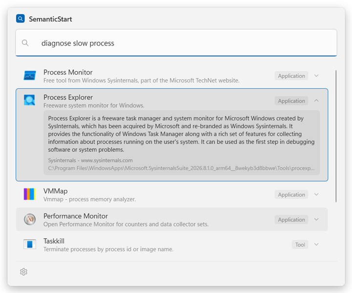

# SemanticStart

Semantic search for the Windows Start menu. Describe what you want to do — *"free up disk space"*,
*"sandbox for testing untrusted apps"*, *"host a website locally"* — and get the app, setting, or
built-in Windows feature that actually does it.

Windows Start search is lexical: it matches substrings of names. If you don't already know what a
tool is called, you can't find it. SemanticStart builds a local semantic index of your installed
applications **and** built-in Windows features, then serves it from a Start-like overlay. All
inference runs locally; no query ever leaves the machine. The index [keeps itself
current](#staying-current) in the background — a program installed five minutes ago is already
findable, and one you uninstalled has already stopped ranking.



The query describes an investigation rather than naming a utility. Process Monitor and Process
Explorer rise to the top because their indexed descriptions and capabilities match process
diagnosis; expanding Process Explorer shows the synthesized description, publisher, provenance,
and launch path available behind every result. That intent-based ordering is the whole product.

On the Windows 11 machine these numbers were taken from:

| | |
|---|---|
| Entities indexed | 583 |
| Query latency | 3.1 ms median, 5.0 ms p95 |
| Relevance corpus | 57/65, MRR 0.866, correct answer first 84% of the time |
| Full rebuild | ~7 minutes, once |
| Background refresh | ~4.5 seconds, hourly |
| Re-running one enricher | 2.5 seconds |
| Rescanning one collector | ~10 seconds |

## Download

Download the [latest signed release](https://github.com/markrussinovich/SemanticStart/releases/latest).
The portable builds are self-contained, so nothing else has to be installed — not even the .NET
runtime.

1. Download the build for your processor:
   - AMD64/x86-64: `SemanticStart-<version>-win-x64.zip`
   - ARM64: `SemanticStart-<version>-win-arm64.zip`
2. Unblock it before extracting — Windows marks downloaded archives and the mark is inherited by
   every file inside, which surfaces later as a SmartScreen prompt on launch rather than as
   anything mentioning the zip:
   ```powershell
   Unblock-File .\SemanticStart-<version>-win-<architecture>.zip
   ```
3. Extract anywhere and run `SemanticStart.App.exe`.

Release builds are signed and timestamped. SmartScreen can still warn until a new binary builds
reputation. Each release publishes both zip files' SHA256 checksums next to them.

First launch builds the index and downloads the embedding model once — see [Usage](#usage).

## How it works

<picture>
  <source media="(prefers-color-scheme: dark)" srcset="docs/pipeline-dark.svg">
  
</picture>

**Indexing (offline).** Ten collectors enumerate what is on the machine, in this order — the order
is deduplication precedence, so an earlier source wins when the same thing is found twice:

| Collector | Source id | What it finds |
|---|---|---|
| `AppsFolderCollector` | `appsfolder` | AppsFolder entries: MSIX/UWP packages and Win32 apps alike |
| `PowerToysCollector` | `powertoys` | Individual PowerToys utilities, enriched from their official Learn documentation |
| `StartShortcutCollector` | `startmenu` | `.lnk` shortcuts in the per-user and all-users Start Menu |
| `UninstallRegistryCollector` | `uninstall` | Installed programs registered under the uninstall keys |
| `SettingsPageCollector` | `mssettings` | `ms-settings:` pages |
| `ControlPanelCollector` | `controlpanel` | Control Panel applets and MMC snap-ins |
| `OptionalFeatureCollector` | `optionalfeature` | Windows optional features and capabilities |
| `SystemToolCollector` | `systemtool` | Curated System32 tools |
| `CommandAliasCollector` | `command` | Console executables registered under `App Paths` |
| `PathExecutableCollector` | `path` | Executables on the user's and system `PATH` |

The last two are the ones that reach what Start will not show you: console tools that ship inside
installed suites and that Windows deliberately hides, and developer tooling that installs by
unpacking an archive and registers nothing at all. `PathExecutableCollector` runs last on purpose —
a `PATH` directory holds a binary but knows nothing about it, so when the same executable is also
found somewhere that carries a real display name, that is the record worth keeping.

Each entity is then enriched from local documentation and, optionally, online sources. Synthesis
distills that documentation into a one-line description, a list of tasks the user might want,
and synonyms — this is what closes the gap between how people phrase intent and how vendors name
products. The result is embedded with `all-MiniLM-L6-v2` via an
`IEmbeddingGenerator<string, Embedding<float>>` provider backed by ONNX Runtime. The local
provider is composed from separate tokenizer/batch preparation, ONNX scoring, and
mean-pooling/normalization stages, so another provider such as Ollama can be substituted without
changing indexing or retrieval. The model id and dimensions come from the provider metadata and
are persisted with the index; changing either requires a rebuild.

`OnnxEmbeddingGenerator` uses BERT tokenization by default and also accepts a compatible
`Microsoft.ML.Tokenizers.Tokenizer` implementation. The supplied tokenizer must match the
model's vocabulary and input requirements. Changing effective tokenization requires rebuilding
the index and using a distinct model id.

**Querying (hot path).** Two arms run per query. The vector arm supplies semantic recall; the
lexical FTS5/BM25 arm supplies precision on literal names. Neither is sufficient alone — pure vector
search fails on short prefixes like `wor`, and pure lexical search cannot answer *"free up disk
space"*. Results are fused with Reciprocal Rank Fusion, then adjusted by literal-name boosts, by an
adjacency signal that rewards saying the query's words next to each other rather than merely
somewhere — which is what separates *"virtual memory"* from a *"Virtual PC"* label sitting near a
mention of memory — and by what you actually launch. Results whose evidence is weak are dropped
rather than padding the list to the requested count, so a query nothing answers well shows *"No good
matches found"* instead of a page of near-misses.

The vector hot path uses `System.Numerics.Tensors.TensorPrimitives` for SIMD dot products and
normalization. A local benchmark over 384-dimensional vectors and 10,000-row scans measured
2.13x isolated dot-product throughput and 1.44x retrieval-shaped matrix-scan throughput versus
the previous hand-written `Vector<float>` loop on the validation machine. The reproducible probe
and its run instructions are in
[`benchmarks/README.md`](benchmarks/README.md); exact timings vary by CPU and runtime.

## Requirements

- Windows 10 1809 or later, AMD64 or ARM64
- No administrator rights, no service, no driver, and **no modification of `explorer.exe`**
- CPU-only: no NPU or GPU required

## Building

```powershell
.\run.ps1
```

`run.ps1` stops any running instance, builds, and starts the app. Stopping first is the point:
SemanticStart lives in the tray, so a copy from the last build is usually still running and holding
`SemanticStart.Core.dll` open, which fails the build with a locked-file error that looks like a
build problem and is not one. It finishes by printing the hotkey that actually registered — worth
seeing rather than assuming, since a contended chord falls back to the next free one.

`-Test` runs the suite before launching, `-Configuration Debug` builds Debug, `-NoLaunch` builds
only.

The underlying commands, if you would rather run them yourself:

```powershell
dotnet build SemanticStart.slnx
dotnet test tests\SemanticStart.Tests
```

Portable, self-contained AMD64 build (no .NET runtime needed on the target machine):

```powershell
dotnet publish src\SemanticStart.App -c Release -r win-x64 --self-contained true -p:PublishSingleFile=true -o artifacts\portable
```

Use `-r win-arm64` for the ARM64 build.

`PublishSingleFile` folds the managed assemblies into the exe but leaves the native dependencies —
ONNX Runtime, the SQLite engine, WPF's unmanaged libraries — beside it, so the whole folder is the
unit that ships, not just the exe.

### Releasing

`.github/workflows/release.yml` builds AMD64 and ARM64 packages on a clean runner, runs the tests,
and attaches both signed zips and their SHA256 files to a GitHub Release. Every push to `main`
that changes more than documentation cuts a release. The patch version is bumped automatically:
`Directory.Build.props` names the release line (`1.1.0` releases `v1.1.0`, then `v1.1.1`,
`v1.1.2`, …), so to start a new line change it, for example to `1.2.0`:

```xml
<Version>1.2.0</Version>
```

It can also be run from the Actions tab, optionally naming an exact version or drafting the
release instead of publishing it — useful for rehearsing a release, or reissuing one after a bad
build.

#### Code signing

The workflow signs both architectures' `SemanticStart.App.exe` with [Azure Artifact Signing](https://learn.microsoft.com/azure/artifact-signing/)
when the repository is configured for it, and builds unsigned when it is not — so the release path
works either way. Signing runs before packaging, so the published SHA256 is the hash of the signed
binary. It uses GitHub OIDC, so Azure issues a short-lived token for each release instead of storing
a client secret. Configure it with three secrets and three variables:

| Setting | Kind | Value |
|---|---|---|
| `AZURE_TENANT_ID` | secret | Entra tenant ID |
| `AZURE_CLIENT_ID` | secret | Entra application ID |
| `AZURE_SUBSCRIPTION_ID` | secret | Azure subscription ID |
| `AZURE_SIGNING_ACCOUNT` | variable | Artifact Signing account name |
| `AZURE_CERTIFICATE_PROFILE` | variable | Certificate profile name |
| `AZURE_SIGNING_ENDPOINT` | variable | Region endpoint |

Setting some but not all of them fails the build rather than silently shipping unsigned. The
Entra application needs a federated credential matching the GitHub OIDC subject for the `release`
environment and the **Artifact Signing Certificate Profile Signer** role. GitHub may use immutable
owner/repository IDs in that subject rather than the repository names. The profile must be
**Public Trust** for the signature to affect SmartScreen.

## Usage

Run `SemanticStart.App.exe`. It lives in the tray and opens on **Win+Alt+.** — Win, Alt, and the
period key. On first run the Settings window opens in setup mode so you can review the hotkey,
whether to start at sign-in, and whether to look up documentation online while indexing (on by
default); choosing **Build index** builds the index (downloading the ~90 MB embedding model once).
Everything can be changed later in Settings.

| Key | Action |
|---|---|
| `Win+Alt+.` | Open the overlay (configurable) |
| `Enter` | Launch |
| `Down` / `Up` | Move into the results and back to the search box |
| `Right` / `Left` | Show / hide the selected result's description (`Ctrl+D` toggles) |
| `Ctrl+C` | Copy the selected result's command line |
| `Ctrl+Enter` | Launch as administrator |
| `Ctrl+Shift+Enter` | Open file location |
| `Esc` | Dismiss |

The overlay follows the system light/dark theme and accent color live, and shows each entry's real
Shell icon (including MSIX/UWP assets) via `IShellItemImageFactory` — the same source Start uses.

Every result carries a copy button next to its kind badge. It puts the command that would start the
entry on the clipboard, which for half of them is not the thing the index stores: a Settings page is
a URI, a Control Panel applet and an MMC snap-in are arguments to a host program, and a packaged
app's launch target is an AppUserModelId that runs only behind `explorer.exe shell:AppsFolder\`. The
button copies what you can actually paste and run.

### Where descriptions come from

Description quality is what makes intent search work. Every description, task phrase, and synonym is
distilled from documentation the machine already has or can fetch. Nine enrichers contribute, six of
them offline:

| Enricher | Network | What it reads |
|---|---|---|
| `pe-version` | no | PE version resources: file description, product name, company |
| `msix-manifest` | no | `AppxManifest.xml` display name and description |
| `shortcut` | no | `.lnk` comment text and the Start Menu folder it sits in |
| `local-docs` | no | `README`, `.md`, `.txt` and help files next to the executable |
| `cli-help` | no | `--help` / `/?` output, sandboxed and time-bounded |
| `ui-resources` | no | The program's own menus and dialogs, read from its resources |
| `winget` | yes | winget manifest description, tags, and moniker |
| `learn` | yes | Microsoft Learn pages for built-in tools and settings |
| `wikipedia` | yes | Article lead and feature sections |

`ui-resources` is the one that earns its keep most often, because articles describe what a tool is
*for* while its interface states what it can *do*. Nothing written about Process Explorer mentions
memory; its View menu offers "Physical Memory History". Reading resources structurally also means
reading the right ones — Resource Monitor launches `perfmon.exe`, so its menus describe Performance
Monitor, and the labels that actually belong to it live in the module its icon names.

Nothing is hard-coded, so a tool this project has never heard of is described as well
as a tool it has.

An earlier build handed synthesis to a small local language model (Foundry Local, Ollama, LM Studio).
It was removed. Across the 55-query corpus of the time the two scored the same 50/55, with MRR 0.821
vs 0.823 and top-1 74% vs 76% — a difference of one case. **A local model did not measurably help
SemanticStart find things**, and it cost a multi-GB download and roughly five extra minutes per
rebuild, so it was not worth carrying.

Settings shows what the index actually holds — applications, system utilities, Windows settings,
total entries, and size on disk — so you can see how much of the machine was found.

Rebuilding belongs to the app, not to the Settings window: you can close Settings while indexing
runs in the background, and a tray notification tells you when it finishes. Reopening Settings
rejoins the build already in progress. (It used to be the other way round, so closing the window
silently threw away the first index build and left the app finding nothing.)

### Staying current

An index is correct for exactly as long as the machine stands still, and the moment it stops being
correct is the moment it matters most: installing a program is when you are most likely to reach for
a launcher to run it, and until something rescans, the thing you just installed is the one thing that
cannot be found. The reverse is worse — an uninstalled program keeps ranking until you launch it and
it fails.

So SemanticStart rescans on its own, on by default (**Keep the index up to date automatically**):

- **Two minutes after launch** — late enough to stay out of the way of a login, where every startup
  program is competing for the same disk, and early enough that anything installed while the app was
  closed shows up quickly.
- **When the Start Menu changes** — installing or removing a program writes there, which is the
  cheapest reliable signal that the machine has changed. A refresh waits for 45 seconds of quiet
  first, because an installer writes its shortcuts over several seconds and scanning mid-install
  indexes a half-written folder.
- **Hourly after that** — measured from the end of the previous scan, and from wall-clock time
  rather than a timer, so a laptop that sleeps overnight refreshes when it wakes instead of coming
  back still holding most of an hour.

This is affordable only because a rebuild is incremental: discovery runs, stored content hashes are
compared, and everything unchanged is skipped before any documentation is gathered or any text is
embedded. **A scan of an unchanged machine takes about 4.5 seconds** — a hundredth of the seven
minutes a full rebuild costs, and the reason this can run on a schedule at all.

A background scan never interrupts anything. It is skipped while the overlay is open, because a
refresh ends by reloading the search engine and would stall the query you are typing; it is skipped
while a rebuild you started is already running; and it never fires on an empty index, since a first
build is minutes of work that belongs to setup. Nothing is announced — a notification every hour
about something nobody asked for is how a notification channel gets muted.

Two keys in `settings.json` control it: `backgroundRefresh` (default `true`) and
`refreshIntervalMinutes` (default `60`, clamped to 15–1440).

### The CLI

`SemanticStart.Cli` is a diagnostic front end over the same engine:

```powershell
dotnet run --project src\SemanticStart.Cli -- index [--force]   # build or rebuild the index
dotnet run --project src\SemanticStart.Cli -- index --refresh ui-resources
dotnet run --project src\SemanticStart.Cli -- index --sources path
dotnet run --project src\SemanticStart.Cli -- search "<query>"  # query it
dotnet run --project src\SemanticStart.Cli -- eval              # run the relevance corpus
dotnet run --project src\SemanticStart.Cli -- stats             # index statistics
dotnet run --project src\SemanticStart.Cli -- enrich "<name>"   # what each enricher produced
dotnet run --project src\SemanticStart.Cli -- diagnose "<query>" --name "<entity>"
```

`--refresh` re-runs only the named enrichers and reuses every stored document for the rest. Nothing
is re-embedded unless its text actually changed, which turns the edit-measure loop on a single
enricher from a seven-minute rebuild into 2.5 seconds.

`--sources` is the same idea aimed at discovery instead of enrichment: it rebuilds only the named
collectors and leaves every other source in the index untouched, which takes about ten seconds.
`PATH` is the source that needs it, because it goes stale on its own — installing a tool appends a
directory, and picking that up should not cost a pass over the network enrichers. Discovery still
runs every collector even when the build is scoped, since deduplication is decided across sources
in registration order; only the expensive stages are skipped. Sources are named by the id prefix in
the [collector table](#how-it-works) above.

`diagnose` answers the question `search` cannot: why something *didn't* come back. A missing result
is either "no arm retrieved it" or "an arm retrieved it and a surfacing floor rejected it" — opposite
fixes, indistinguishable from outside. It runs the query twice against one snapshot, once with the
shipped floors and once with every floor disabled, and diffs the two.

### Local MCP server

`SemanticStart.App.exe --mcp` lets an LLM search and inspect the existing SemanticStart index
through the [Model Context Protocol](https://modelcontextprotocol.io/). The same process starts the
normal SemanticStart tray app, hotkey, and overlay while serving a read-only stdio MCP connection.
It never opens a TCP port or modifies the index through MCP.

#### Prerequisites

1. Run SemanticStart once and let its first index build finish. This creates
   `%LOCALAPPDATA%\SemanticStart\index.sqlite`, `vectors.bin`, and the local embedding model.
2. Build the app:

```powershell
dotnet build src\SemanticStart.App\SemanticStart.App.csproj -c Release
```

Configure an MCP client to launch the built DLL. The surrounding configuration property varies by
client, but the server entry itself has this shape:

```json
{
  "semanticstart": {
    "command": "C:\\path\\to\\SemanticStart\\src\\SemanticStart.App\\bin\\Release\\net10.0-windows\\SemanticStart.App.exe",
    "args": ["--mcp"]
  }
}
```

For development, use `dotnet` with arguments
`["run", "--project", "C:\\path\\to\\SemanticStart\\src\\SemanticStart.App", "--", "--mcp"]`.

If the tray app is not running, the MCP-launched process starts both the tray app and server. If a
tray instance already owns the hotkey, the new process serves only that client's stdio connection
and leaves the existing app in place. Closing the MCP connection ends the process it launched;
multiple clients can therefore use independent sessions without creating duplicate tray icons.

#### Tools

| Tool | Purpose |
|---|---|
| `search` | Hybrid semantic and lexical search. Accepts a natural-language query and a result limit from 1 to 50. |
| `get_entity` | Returns the full synthesized profile for an exact stable entity ID returned by another tool. |
| `list_entities` | Browses by name, kind, publisher, collector source, or category, with stable-ID pagination. |
| `get_documents` | Returns bounded enrichment text and provenance for one entity, optionally filtered by provider. |
| `get_index_status` | Reports index availability, entity count, embedding model, transport, and read-only status. |
| `refresh_index` | Reloads the in-memory search snapshot after the desktop app rebuilds the index. |

A typical agent workflow is to call `search`, use `get_entity` on promising IDs, and request
`get_documents` only when it needs the underlying source material. `get_documents` returns at most
12,000 characters by default and accepts an explicit cap up to 50,000 characters.

Launch targets, icon paths, source URIs, and raw collector metadata can reveal machine-specific
paths. They are excluded by default and returned only when the caller opts in through
`includeLaunchInfo`, `includeSourceUri`, or `includeRawMetadata`.

The MCP side reads the index with SQLite's read-only mode and shares it safely with the app's
WAL-backed indexer. It keeps a search snapshot in memory; call `refresh_index` after a rebuild to
make the MCP tools see the new contents. If the index or model is missing or incompatible,
`get_index_status` reports it as unavailable rather than creating or replacing anything.

The server itself performs no network requests. The MCP client may still send tool results to its
configured model, so treat the returned list of installed software and any explicitly requested
paths or documents according to that model provider's privacy policy.

## Privacy

Queries never leave the machine. The only network traffic is the one-time embedding model download
and online enrichment during indexing, which sends only app and feature names, is cached to disk,
and is on by default but can be turned off in setup or Settings; the index is fully functional
without it, just less able to find tools you cannot name. No inference of any kind leaves the
machine.

A built index is a list of what is installed on the machine that built it, so it is treated as local
data: it lives in `%LOCALAPPDATA%\SemanticStart` and is ignored by source control.

## Layout

| Project | Purpose |
|---|---|
| `src/SemanticStart.Core` | Collectors, enrichment, synthesis, embeddings, storage, retrieval |
| `src/SemanticStart.Cli` | Diagnostic CLI (`index`, `search`, `eval`, `stats`, `enrich`, `diagnose`) |
| `src/SemanticStart.App` | WPF overlay, activation, tray icon, settings, and `--mcp` stdio server mode |
| `tests/SemanticStart.Tests` | Unit and regression tests |
| `tools/make-icon.ps1` | Redraws the app icon (`src/SemanticStart.App/Assets/SemanticStart.ico`) |

The icon is generated rather than drawn by hand so that every size in the `.ico` is rendered at its
own resolution — a 16px tray icon resampled from a big bitmap loses the magnifier's ring. Run the
script only when the mark changes; the `.ico` it produces is checked in.

The query engine is a standalone library with no UI dependency, so it can also back a Command
Palette or PowerToys Run extension later.

## License

MIT. See [LICENSE](LICENSE).
