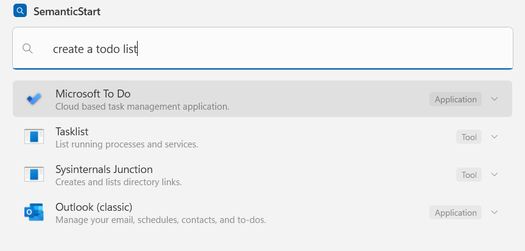
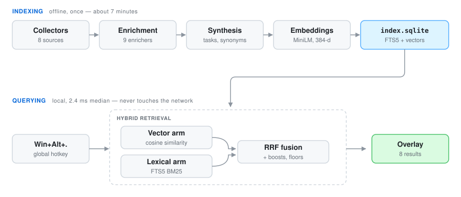

# SemanticStart

Semantic search for the Windows Start menu. Describe what you want to do — *"free up disk space"*,
*"sandbox for testing untrusted apps"*, *"host a website locally"* — and get the app, setting, or
built-in Windows feature that actually does it.

Windows Start search is lexical: it matches substrings of names. If you don't already know what a
tool is called, you can't find it. SemanticStart builds a local semantic index of your installed
applications **and** built-in Windows features, then serves it from a Start-like overlay. All
inference runs locally; no query ever leaves the machine.



Nothing in that query matches the name of the app that answers it. "Todo" is not a word in
"Microsoft To Do", and the two tools below it are there because a *list* is something they make.
Outlook is last because its tasks are real but secondary. That ordering is the whole product.

On the Windows 11 machine these numbers were taken from:

| | |
|---|---|
| Entities indexed | 521 |
| Query latency | 2.4 ms median, 3.2 ms p95 |
| Relevance corpus | 57/61, MRR 0.874, correct answer first 83% of the time |
| Full rebuild | ~7 minutes, once |
| Re-running one enricher | 2.5 seconds |

## How it works

<picture>
  <source media="(prefers-color-scheme: dark)" srcset="docs/pipeline-dark.svg">
  
</picture>

**Indexing (offline).** Eight collectors enumerate AppsFolder/MSIX apps, Start shortcuts, uninstall
registry entries, `ms-settings:` pages, Control Panel applets and MMC snap-ins, Windows optional
features, System32 tools, and MSIX command aliases registered under `App Paths` — the last of these
reaches console tools that ship inside installed suites and that Windows deliberately hides from
Start. Each entity is enriched from local documentation and, optionally, online sources. Synthesis
then distills that documentation into a one-line description, a list of tasks the user might want,
and synonyms — this is what closes the gap between how people phrase intent and how vendors name
products. The result is embedded with `all-MiniLM-L6-v2` via ONNX Runtime.

**Querying (hot path).** Two arms run per query. The vector arm supplies semantic recall; the
lexical FTS5/BM25 arm supplies precision on literal names. Neither is sufficient alone — pure vector
search fails on short prefixes like `wor`, and pure lexical search cannot answer *"free up disk
space"*. Results are fused with Reciprocal Rank Fusion, then adjusted by literal-name boosts and by
what you actually launch. Results whose evidence is weak are dropped rather than padding the list to
the requested count, so a query nothing answers well shows *"No good matches found"* instead of a
page of near-misses.

## Requirements

- Windows 10 1809 or later, x64
- No administrator rights, no service, no driver, and **no modification of `explorer.exe`**
- CPU-only: no NPU or GPU required

## Building

```powershell
.\run.ps1
```

`run.ps1` stops any running instance, builds, and starts the app. Stopping first is the point:
SemanticStart lives in the tray, so a copy from the last build is usually still running and holding
`SemanticStart.Core.dll` open, which fails the build with a locked-file error that looks like a
build problem and is not one. It finishes by printing the hotkey that actually registered — worth
seeing rather than assuming, since a contended chord falls back to the next free one.

`-Test` runs the suite before launching, `-Configuration Debug` builds Debug, `-NoLaunch` builds
only.

The underlying commands, if you would rather run them yourself:

```powershell
dotnet build SemanticStart.slnx
dotnet test tests\SemanticStart.Tests
```

Portable, self-contained build (no .NET runtime needed on the target machine):

```powershell
dotnet publish src\SemanticStart.App -c Release -r win-x64 --self-contained true -o artifacts\portable
```

## Usage

Run `SemanticStart.App.exe`. It lives in the tray, builds its index on first run (downloading the
~90 MB embedding model once), and opens on **Win+Alt+.** — Win, Alt, and the period key.

| Key | Action |
|---|---|
| `Win+Alt+.` | Open the overlay (configurable) |
| `Enter` | Launch |
| `Down` / `Up` | Move into the results and back to the search box |
| `Right` / `Left` | Show / hide the selected result's description (`Ctrl+D` toggles) |
| `Ctrl+Enter` | Launch as administrator |
| `Ctrl+Shift+Enter` | Open file location |
| `Esc` | Dismiss |

The overlay follows the system light/dark theme and accent color live, and shows each entry's real
Shell icon (including MSIX/UWP assets) via `IShellItemImageFactory` — the same source Start uses.

### Where descriptions come from

Description quality is what makes intent search work. Every description, task phrase, and synonym is
distilled from documentation the machine already has or can fetch. Nine enrichers contribute, six of
them offline:

| Enricher | Network | What it reads |
|---|---|---|
| `pe-version` | no | PE version resources: file description, product name, company |
| `msix-manifest` | no | `AppxManifest.xml` display name and description |
| `shortcut` | no | `.lnk` comment text and the Start Menu folder it sits in |
| `local-docs` | no | `README`, `.md`, `.txt` and help files next to the executable |
| `cli-help` | no | `--help` / `/?` output, sandboxed and time-bounded |
| `ui-resources` | no | The program's own menus and dialogs, read from its resources |
| `winget` | yes | winget manifest description, tags, and moniker |
| `learn` | yes | Microsoft Learn pages for built-in tools and settings |
| `wikipedia` | yes | Article lead and feature sections |

`ui-resources` is the one that earns its keep most often, because articles describe what a tool is
*for* while its interface states what it can *do*. Nothing written about Process Explorer mentions
memory; its View menu offers "Physical Memory History". Reading resources structurally also means
reading the right ones — Resource Monitor launches `perfmon.exe`, so its menus describe Performance
Monitor, and the labels that actually belong to it live in the module its icon names.

Nothing is hard-coded, so a tool this project has never heard of is described as well
as a tool it has.

An earlier build handed synthesis to a small local language model (Foundry Local, Ollama, LM Studio).
It was removed. Across the 55-query corpus of the time the two scored the same 50/55, with MRR 0.821
vs 0.823 and top-1 74% vs 76% — a difference of one case. **A local model did not measurably help
SemanticStart find things**, and it cost a multi-GB download and roughly five extra minutes per
rebuild, so it was not worth carrying.

Settings shows what the index actually holds — applications, system utilities, Windows settings,
total entries, and size on disk — so you can see how much of the machine was found.

Rebuilding belongs to the app, not to the Settings window: you can close Settings while indexing
runs in the background, and a tray notification tells you when it finishes. Reopening Settings
rejoins the build already in progress. (It used to be the other way round, so closing the window
silently threw away the first index build and left the app finding nothing.)

### The CLI

`SemanticStart.Cli` is a diagnostic front end over the same engine:

```powershell
dotnet run --project src\SemanticStart.Cli -- index [--force]   # build or rebuild the index
dotnet run --project src\SemanticStart.Cli -- index --refresh ui-resources
dotnet run --project src\SemanticStart.Cli -- search "<query>"  # query it
dotnet run --project src\SemanticStart.Cli -- eval              # run the relevance corpus
dotnet run --project src\SemanticStart.Cli -- stats             # index statistics
dotnet run --project src\SemanticStart.Cli -- enrich "<name>"   # what each enricher produced
dotnet run --project src\SemanticStart.Cli -- diagnose "<query>" --name "<entity>"
```

`--refresh` re-runs only the named enrichers and reuses every stored document for the rest. Nothing
is re-embedded unless its text actually changed, which turns the edit-measure loop on a single
enricher from a seven-minute rebuild into 2.5 seconds.

`diagnose` answers the question `search` cannot: why something *didn't* come back. A missing result
is either "no arm retrieved it" or "an arm retrieved it and a surfacing floor rejected it" — opposite
fixes, indistinguishable from outside. It runs the query twice against one snapshot, once with the
shipped floors and once with every floor disabled, and diffs the two.

## Privacy

Queries never leave the machine. The only network traffic is the one-time embedding model download
and opt-in enrichment during indexing, which is cached to disk and can be disabled entirely; the
index is fully functional without it. No inference of any kind leaves the machine.

A built index is a list of what is installed on the machine that built it, so it is treated as local
data: it lives in `%LOCALAPPDATA%\SemanticStart` and is ignored by source control.

## Layout

| Project | Purpose |
|---|---|
| `src/SemanticStart.Core` | Collectors, enrichment, synthesis, embeddings, storage, retrieval |
| `src/SemanticStart.Cli` | Diagnostic CLI (`index`, `search`, `eval`, `stats`, `enrich`, `diagnose`) |
| `src/SemanticStart.App` | WPF overlay, activation, tray icon, settings |
| `tests/SemanticStart.Tests` | Unit and regression tests |
| `tools/make-icon.ps1` | Redraws the app icon (`src/SemanticStart.App/Assets/SemanticStart.ico`) |

The icon is generated rather than drawn by hand so that every size in the `.ico` is rendered at its
own resolution — a 16px tray icon resampled from a big bitmap loses the magnifier's ring. Run the
script only when the mark changes; the `.ico` it produces is checked in.

The query engine is a standalone library with no UI dependency, so it can also back a Command
Palette or PowerToys Run extension later.

## License

MIT. See [LICENSE](LICENSE).
